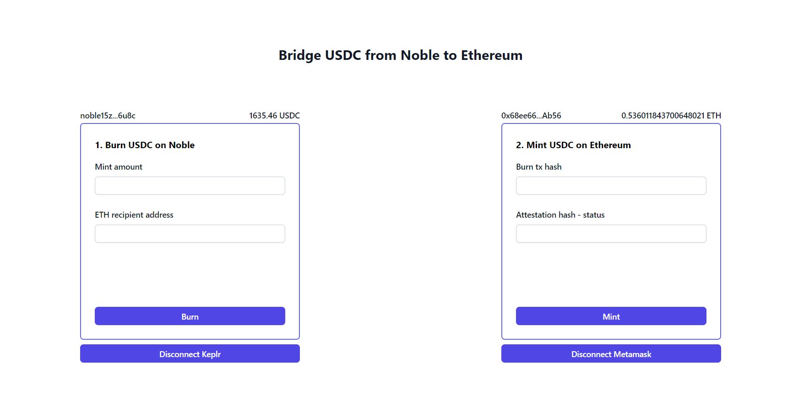

# BRIDGE: NOBLE => ETHEREUM



This project is a simple React application styled with Tailwind CSS that serves as a bridge to transfer USDC from Noble to Ethereum. 
The app allows users to burn USDC on the Noble test chain and mint the corresponding amount on Ethereum Sepolia.

## Features
- Burn USDC on Noble Test Chain
- Mint USDC on Ethereum Sepolia
- Connect/Disconnect Sepolia Wallet Metamask
- Connect/Disconnect Keplr Wallet
- View Balance ETH on Sepolia
- View USDC Balance on Noble

## Usage
1. Connect your Keplr Wallet to view your USDC balance on the Noble test chain.
2. Connect your Sepolia Wallet using Metamask to view your balance on Ethereum Sepolia.
3. Burn USDC on the Noble test chain.
4. Retrieve automatically the attestation from Circle's Attestation API after the USDC is burned with auto-filling.
5. Mint USDC on Ethereum Sepolia using the attestation signature and the message with the MessageTransmitter contract.

### Reasons for This Approach
The separation of these two steps is intentional to better understand the internal mechanisms of the bridge. This division highlights each critical step in the USDC transfer process thanks 'MsgDepositForBurnWithCaller' function.

### Possible Automation
It's important to note that this process could be automated using a relayer provided by Circle and thanks 'MsgDepositForBurn' function. 
Circle offers a relayer function that automatically transfers the burn message to the minting step without manual intervention (second step).

## Resources
- [CCTP Documentation](https://developers.circle.com/stablecoins/docs/evm-smart-contracts#messagetransmitter): Circle's CCTP Documentation
- [Smart contract message transmitter](https://sepolia.etherscan.io/address/0x7865fafc2db2093669d92c0f33aeef291086befd#code): Deployed Smart Contract on Ethereum Sepolia
- [Attestation API](https://developers.circle.com/stablecoins/reference/getattestation): Circle's Attestation API
- [CosmoJS](https://docs.keplr.app/api/cosmjs.html): Keplr Wallet integration


# React + TypeScript + Vite

This template provides a minimal setup to get React working in Vite with HMR and some ESLint rules.

Currently, two official plugins are available:

- [@vitejs/plugin-react](https://github.com/vitejs/vite-plugin-react/blob/main/packages/plugin-react/README.md) uses [Babel](https://babeljs.io/) for Fast Refresh
- [@vitejs/plugin-react-swc](https://github.com/vitejs/vite-plugin-react-swc) uses [SWC](https://swc.rs/) for Fast Refresh

## Expanding the ESLint configuration

If you are developing a production application, we recommend updating the configuration to enable type aware lint rules:

- Configure the top-level `parserOptions` property like this:

```js
export default {
  // other rules...
  parserOptions: {
    ecmaVersion: 'latest',
    sourceType: 'module',
    project: ['./tsconfig.json', './tsconfig.node.json'],
    tsconfigRootDir: __dirname,
  },
}
```

- Replace `plugin:@typescript-eslint/recommended` to `plugin:@typescript-eslint/recommended-type-checked` or `plugin:@typescript-eslint/strict-type-checked`
- Optionally add `plugin:@typescript-eslint/stylistic-type-checked`
- Install [eslint-plugin-react](https://github.com/jsx-eslint/eslint-plugin-react) and add `plugin:react/recommended` & `plugin:react/jsx-runtime` to the `extends` list
